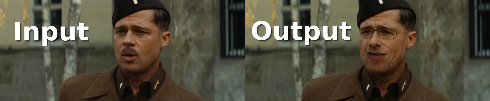
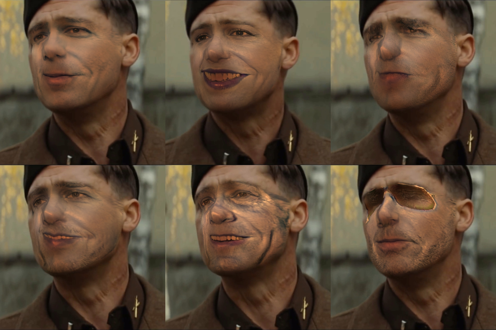
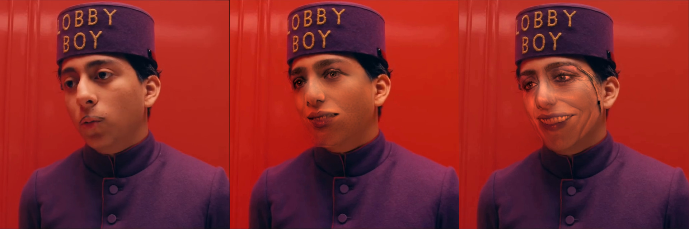

Anonymize video
===============

The purpose of this script is to detect faces in an input video file and replace
them with imaginary faces.

Random faces are generated by the "*Progressive growing of GANs*" DNN model
pre-trained by NVIDIA. Each frame of the input video is extracted using OpenCV
and analyzed using dlib to detect faces and facial landmarks. Each face is
then wrapped with one of the faces imagined by the GAN.

Usage
-----

Clone this repository:

    git clone https://github.com/FlorentRevest/anonymize-video

Install the required python3 modules: (Note: You will need CUDA)

    pip3 install -r requirements.txt

Download the [progressive growing of GANs model from NVIDIA](https://drive.google.com/file/d/188K19ucknC6wg1R6jbuPEhTq9zoufOx4/view).
And save it under models/karras2018iclr-celebahq-1024x1024.pkl

Download the [facial landmarks detector model from dlib](http://dlib.net/files/shape_predictor_68_face_landmarks.dat.bz2).
Extract it and save it under models/shape_predictor_68_face_landmarks.dat

Run the script on an input video:

    ./anonymize-video.py input.mp4 output.avi

Demo files
----------

Two examples of input videos can be downloaded from [here](https://drive.google.com/file/d/1dlGd2YNSF1dX0_FwJpWICwfBGYai3z_v/view)
and [here](https://drive.google.com/file/d/1jcd7VHWGaUD1Npt9Ajbu4WL3L55p_IR1/view)

Troubleshooting
---------------

If this scripts stops early with an error "*0 faces found in a dreamed image.
Aborting.*" just re-run the script once again. This happens from time to time,
when the Progressive GAN network generates faces that are not recognized by dlib

Licenses
--------

The code in anonymize-video.py is an original work released under the terms of
the MIT license. Some of the functions in face_tools.py are issued from
face_morpher, also licensed under MIT.

The code in tfutil.py is from NVIDIA and it is solely required to run their .pkl
model. It is distributed under the terms of the Creative Commons Attribution Non
Commercial.
